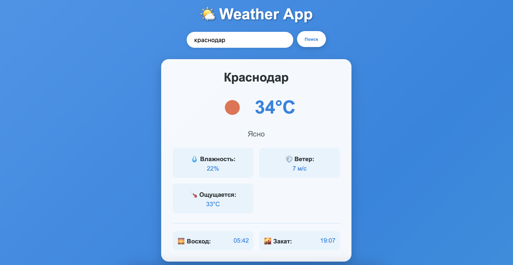
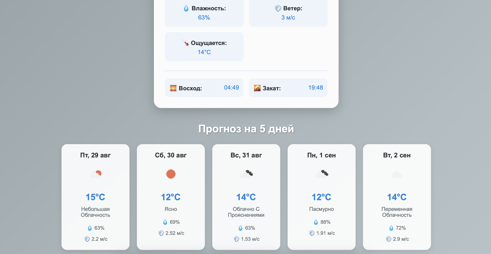
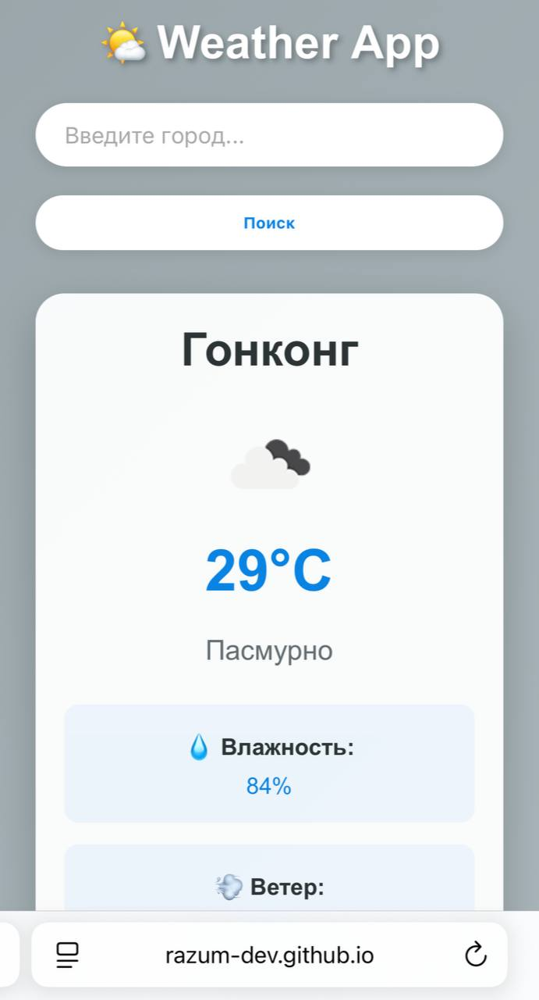
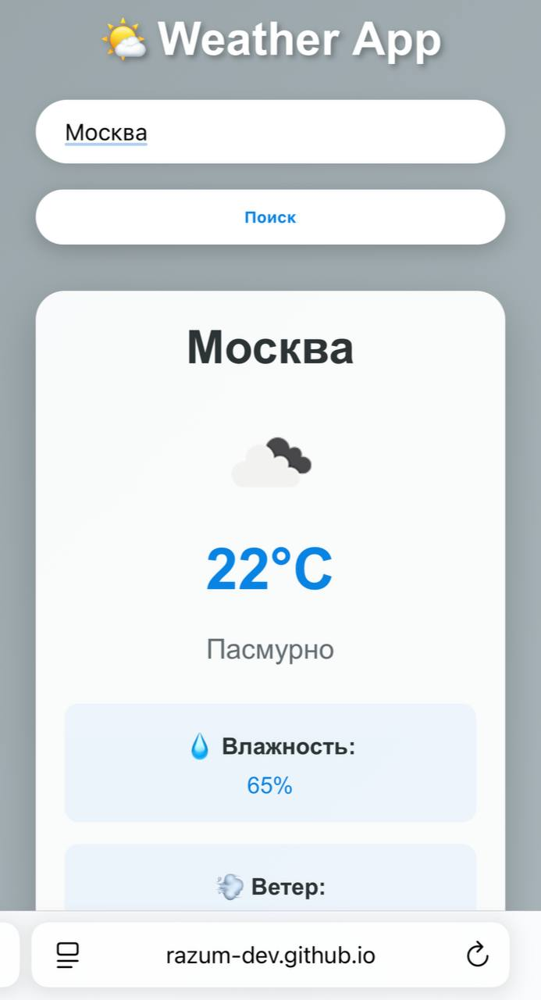

🌤️ Weather App - Погодное приложение
Современное адаптивное веб-приложение для просмотра текущей погоды и прогноза на 5 дней в любом городе мира.

🚀 Живая демо: https://razum-dev.github.io/weather-app/
📸 Скриншоты

🖥️ Десктопная версия

Главный экран	Поиск города	Прогноз на 5 дней
		
📱 Мобильная версия

Главный экран	Поиск города	Прогноз на 5 дней
	
Чистый интерфейс в светлой теме	Элегантная темная тема	Адаптивный дизайн

🎨 Дизайн

Особенности дизайна:

Современный стекломорфизм (glassmorphism)
Плавные анимации и переходы
Динамический фон, меняющийся в зависимости от погоды
Полностью адаптивный интерфейс
Интуитивная навигация
✨ Возможности

🌟 Основные функции

✅ Текущая погода - температура, влажность, ветер, ощущаемая температура
✅ Прогноз на 5 дней - подробный почасовой прогноз
✅ Автоопределение местоположения - автоматическое определение города по IP
✅ Поиск по городам - поддержка городов по всему миру
✅ Динамический фон - меняется в зависимости от типа погоды
🎨 Визуальные особенности

🌈 Анимированные фоны для разных типов погоды (дождь, снег, солнце, облака)
🌅 Восход и закат - красивое отображение времени восхода и заката солнца
📱 Адаптивный дизайн - идеальное отображение на всех устройствах
⚡ Интерактивные элементы - плавные анимации и hover-эффекты
⚙️ Технические возможности

💾 Кэширование данных - быстрое время загрузки при повторных запросах
📍 Сохранение настроек - запоминает последний выбранный город
🌐 Поддержка разных языков - данные на русском языке
⏱️ Таймауты запросов - защита от долгих загрузок
🛠️ Технологии

Frontend

HTML5 - Семантическая верстка
CSS3 - Flexbox/Grid, анимации, адаптивный дизайн
Vanilla JavaScript - ES6+ модули, асинхронные запросы
API

OpenWeatherMap API - данные о текущей погоде и прогнозах
IPAPI - автоматическое определение местоположения
Инструменты

Git - контроль версий
GitHub Pages - хостинг и деплой
Figma - дизайн и прототипирование
🚀 Установка и запуск

1. Клонирование репозитория

bash
git clone https://github.com/razum-dev/weather-app.git
cd weather-app
2. Настройка API ключа

Создайте файл config.js в корневой папке:

javascript
// config.js
const API_KEY = 'ваш_api_ключ_здесь';
3. Получение API ключа

Зарегистрируйтесь на OpenWeatherMap
Получите API ключ в личном кабинете
Добавьте его в файл config.js
4. Запуск приложения

Откройте файл index.html в браузере или используйте Live Server

📁 Структура проекта

text
weather-app/
├── index.html          # Главный HTML файл
├── style.css           # Стили и анимации
├── script.js           # Основная логика приложения
├── config.js           # Файл с API ключом (в .gitignore)
├── screenshots/        # Скриншоты приложения
│   ├── light-theme.png
│   ├── dark-theme.png
│   └── mobile-view.png
└── README.md           # Документация
🌐 Браузерная поддержка

✅ Chrome 90+
✅ Firefox 88+
✅ Safari 14+
✅ Edge 90+

📄 Лицензия

Этот проект является образовательным и создан для портфолио. API ключи и данные погоды предоставляются OpenWeatherMap.
